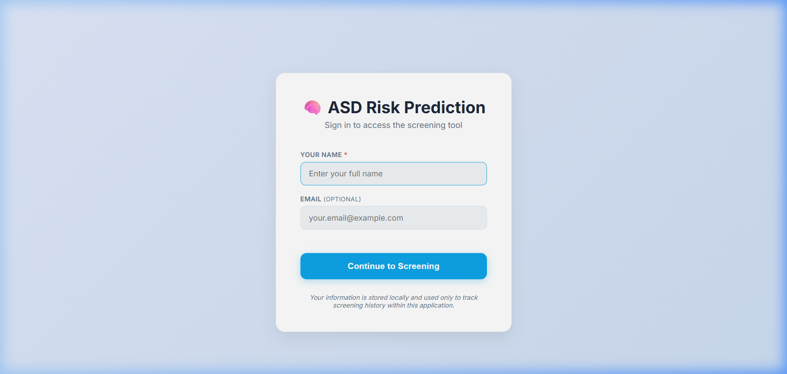
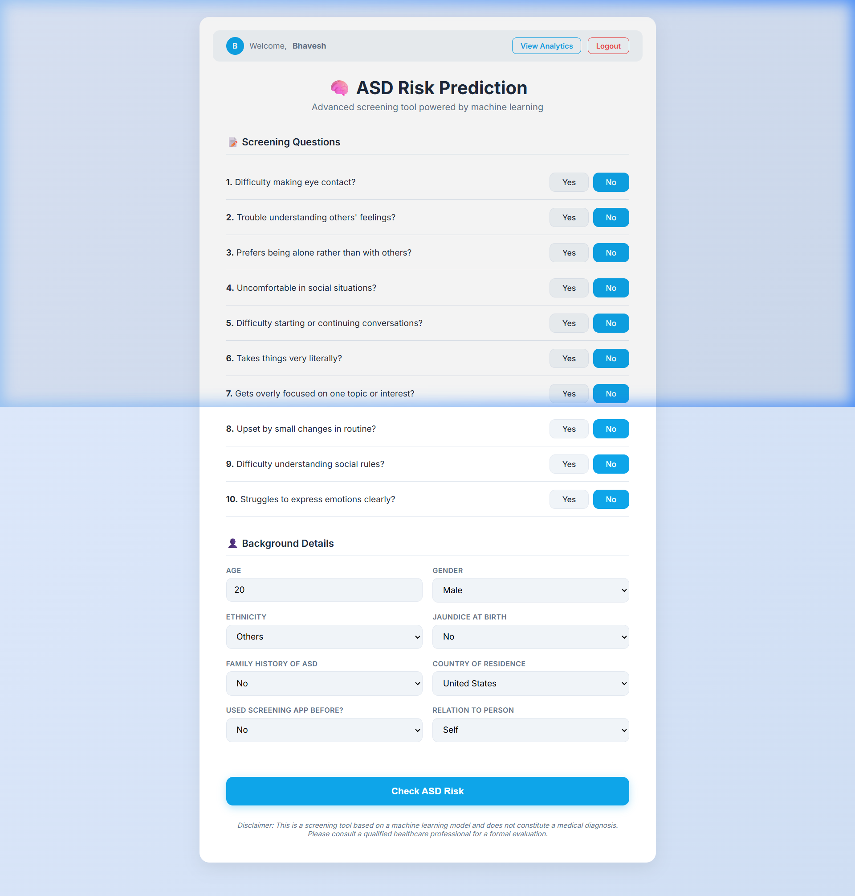
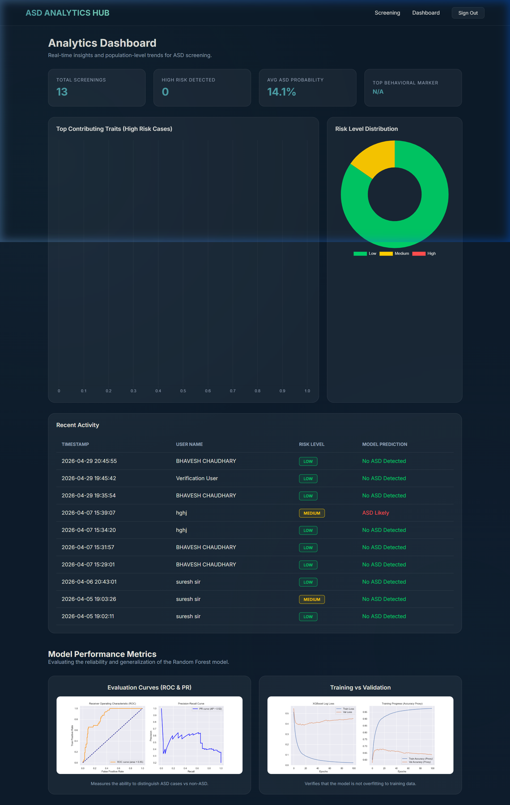

# 🧠 Autism Spectrum Disorder (ASD) Screening System

A comprehensive, AI-driven screening tool designed to provide preliminary assessments for Autism Spectrum Disorder (ASD). This project combines a robust Machine Learning pipeline with a modern, user-centric web interface to offer accessible and explainable screening.

## 🚀 Features
- **Modern UI/UX:** Responsive design with Glassmorphism and dark mode.
- **Machine Learning Core:** Optimized Random Forest model with SMOTE class balancing.
- **Explainable AI (XAI):** Identifies and explains the specific traits contributing to each prediction.
- **Analytical Dashboard:** Real-time population-level trends and data visualization using Chart.js.
- **Clinical Logging:** Automated screening records saved to Excel for medical auditing.

## 🛠️ Tech Stack
- **Backend:** Flask (Python)
- **Frontend:** HTML5, Vanilla CSS, Jinja2, Chart.js
- **Machine Learning:** Scikit-learn, XGBoost, Imbalanced-learn (SMOTE)
- **Data Handling:** Pandas, NumPy, OpenPyXL

---

## 🖥️ Application Preview

### 1. Secure Login
The application features a secure and elegant entry point where users can log in with their details to start the screening process.


### 2. Behavioral Screening
The core interface presents a 10-point behavioral questionnaire (A1-A10 scores) along with demographic and medical history.


### 3. Analytical Dashboard
A high-end dashboard providing real-time insights, including risk distribution, top behavioral markers, and model performance metrics (ROC/PR curves).


---

## 🤖 Model Information
The system uses a **Random Forest Classifier** as its primary engine. 
- **Training Strategy:** 70% Train, 15% Validation, 15% Test.
- **Optimization:** Hyperparameter tuning via Randomized Search CV.
- **Reliability:** Validated using ROC-AUC and Precision-Recall curves to ensure high sensitivity (recall), which is critical for healthcare screening.

## 📦 Installation & Setup
1. Clone the repository:
   ```bash
   git clone https://github.com/Bhavesh1411/Autism-Spectrum-Disorder-Mini-Project.git
   ```
2. Install dependencies:
   ```bash
   pip install -r dependencies.txt
   ```
3. Run the application:
   ```bash
   python app_flask.py
   ```
4. Access at `http://127.0.0.1:5000`

---

## ⚖️ Disclaimer
*This tool is for screening purposes only and does not constitute a medical diagnosis. Please consult a qualified healthcare professional for a formal evaluation.*
